# Работа с Google Sheets


Перед тем как мы начнем работу с Google Sheets, необходимо настроить Ваш проект. Это не займет много времени и сил, если Вы будете следовать строго по инструкции. Итак, начнем!
1. Если у Вас еще нет аккаунта гугл, создайте его.
2. Переходим к [созданию проекта](https://console.cloud.google.com/cloud-resource-manager): перейдите по этой ссылки и нажмите "Создать проект".
   
   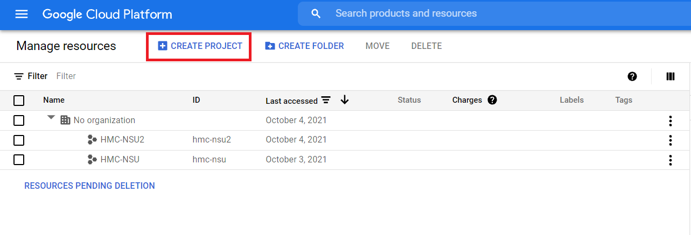
   
3. Придумайте и введите имя проекта, с учетом допустимых символов. Нажмите «Создать».
   
   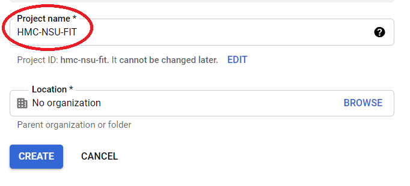
   
4. Переходим по [ссылке](https://console.cloud.google.com/iam-admin/iam). Посмотрите,чтобы роль вашего аккаунта была "Владелец".
   
   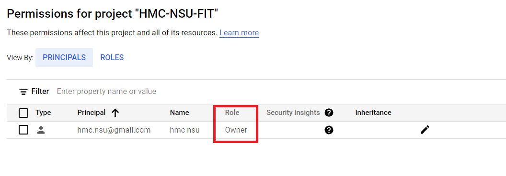
   
   * Если это не так, нажмите на редактирование.
   
   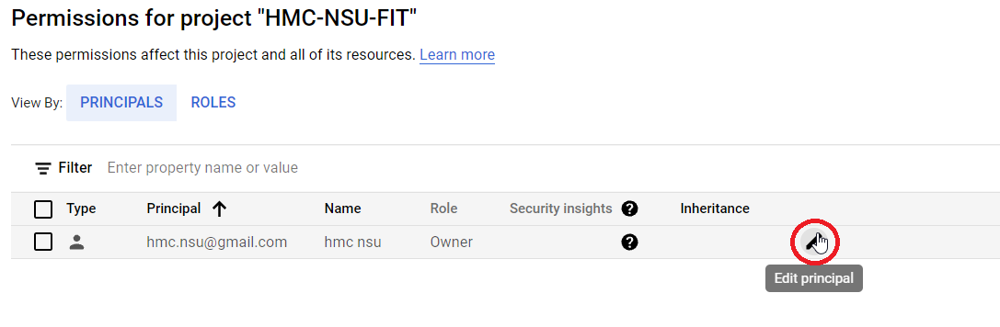
   
   * Нажмите на выподающее меню
   
   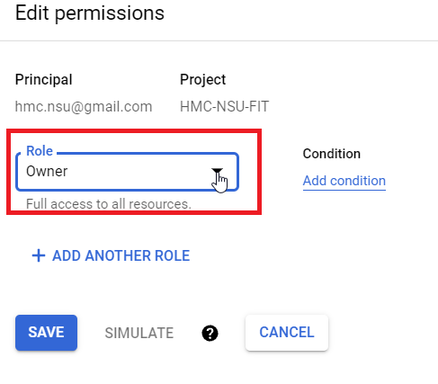
   
   * Выберите "Владелец" и сохраните изменения.
   
   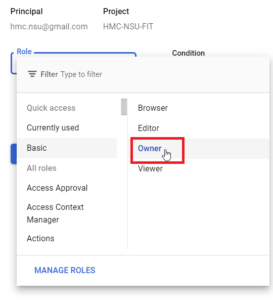
   
5. Перейдите по [ссылке](https://console.cloud.google.com/iam-admin/serviceaccounts) для настройки сервисного аккаунта. 
   
   * Нажмите "Создать сервисный аккаунт".
   
   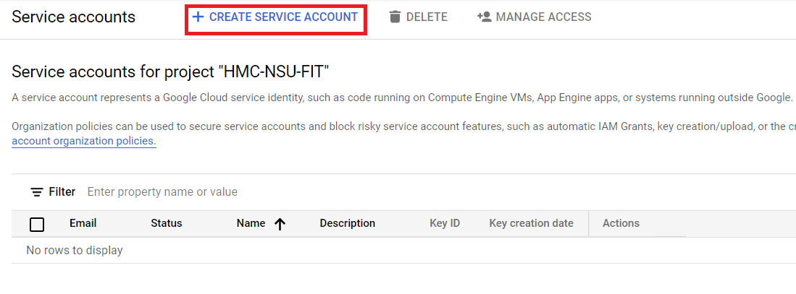
   
   * Введите любое имя для сервисного аккауна и нажмите "Создать и продолжить". id сгенерируется автоматически.
   
   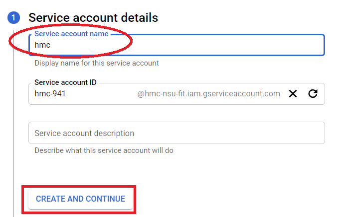
   
   * Нажмите на выподающее меню и выберете роль "Владельца". Нажмите "продолжить".
   
   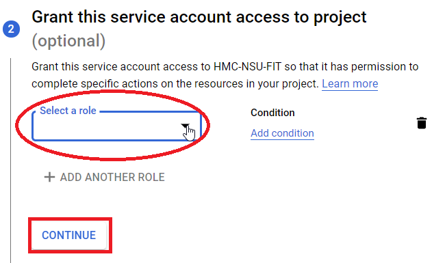  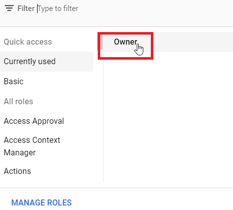
   
   * Данные поля оставляем пустыми, нажимаем "сделать".
   
   
   
6. Скопируйте и сохраните email сервисного аккаунта. Он понадобится потом для предоставления доступа к таблицам.
   
   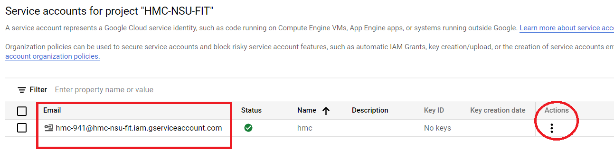
   
7. Теперь нам нужно сгенерировать ключ. 
   
   * Для этого нажмите на три точки и выберите "Управление ключами".
   
   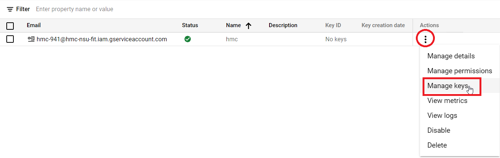
     
   * Нажмите "Добавить ключ" и выберете "Создать новый ключ" .
   
   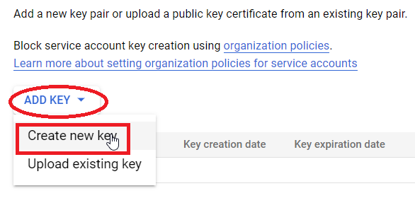
     
   * Выберите тип JSON и нажмите "Создать". После этого на ваш компьютер скачается созданный ключ. Сохраните его, скоро
   он нам понадобится. После этого у Вас на экране появится окошко, которое нужно будет закрыть. Оно просто оповещает 
   Вас о том, что ключ скачался.
   
   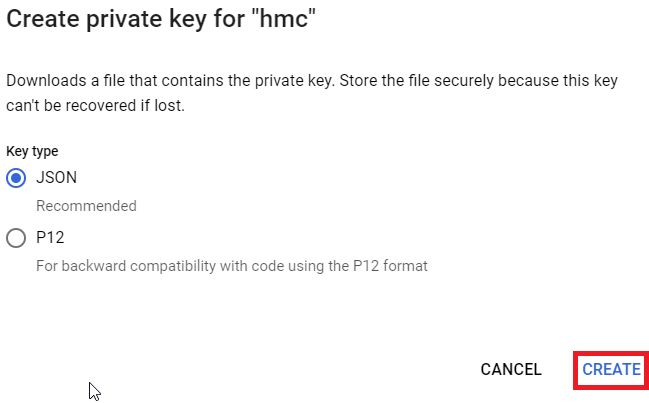
   
8. Перейдите по [ссылке](https://console.cloud.google.com/apis/dashboard),  чтобы включить необходимые сервисы.
   
   * Нажмите "Включить API и сервисы".
   
   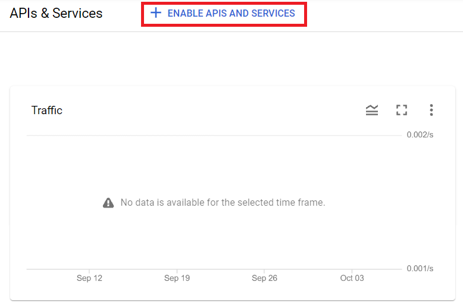  
   
   * Введите в строку поиска «google drive» и кликните по сервису «Google Drive API»

   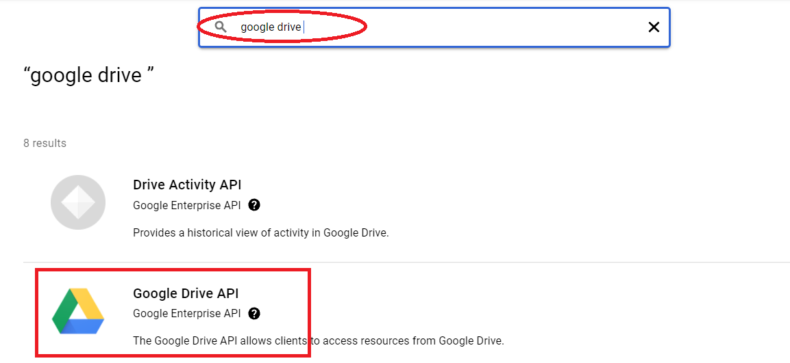

   *  Нажмите "Включить"
   
   

   * Снова переходим по [ссылке](https://console.cloud.google.com/apis/dashboard) и нажимаем "Включить API и сервисы".

   

   * Введите в строку поиска «sheet» и кликните на сервисе «Google Sheets API»

   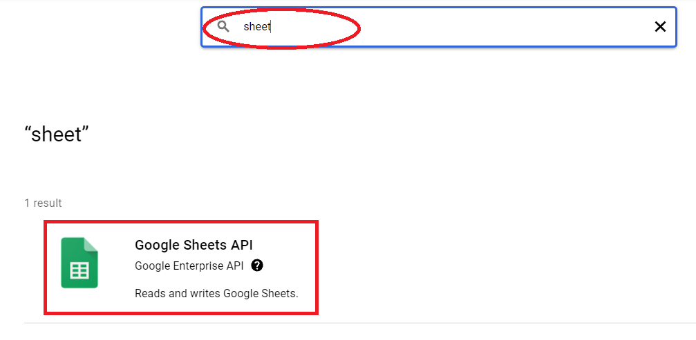
   
   *  Нажмите "Включить"

   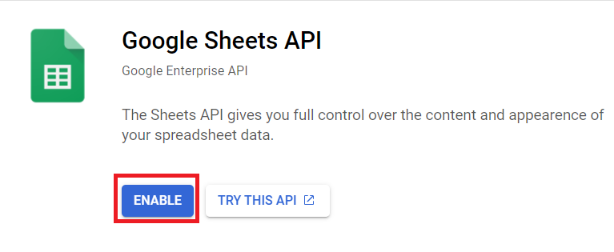
   
9. Заходим в таблицы с тем аккаунтом, который настраивали для проекта.

   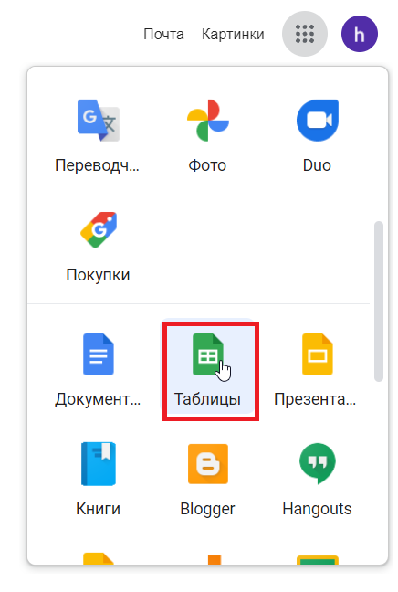
      
   * Создаем пустой файл.
   
   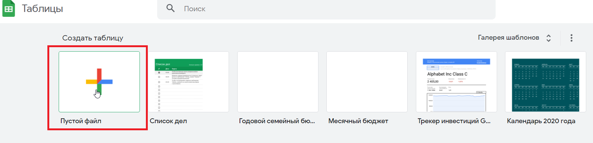

   * Нажимаем на настройки доступа.
   
   

   * Придумываем имя для таблицы, записываем его и сохраняем.
   
   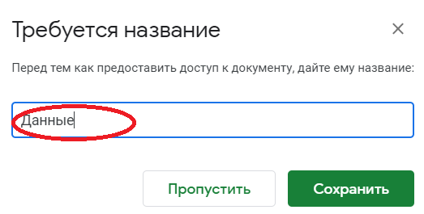

   * Вставляем наш сохранненый сервисный аккаунт (п.6) и нажимаем на всплывшее окно. 

   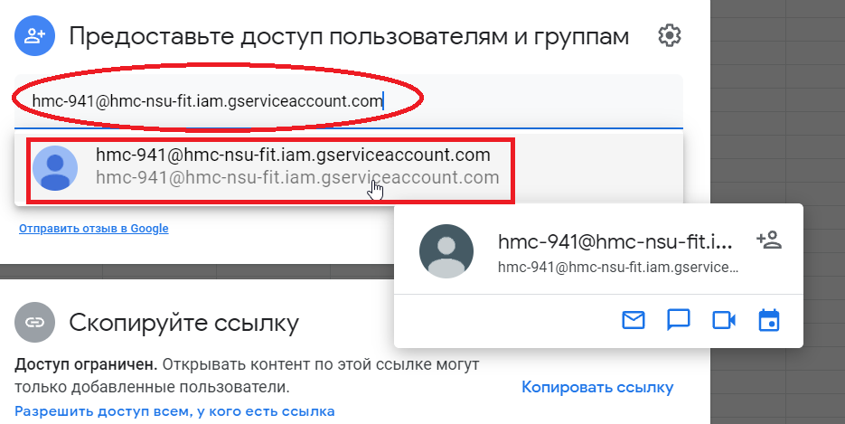
   
   * Выбираем роль редактора и нажимаем "Отправить".
   
   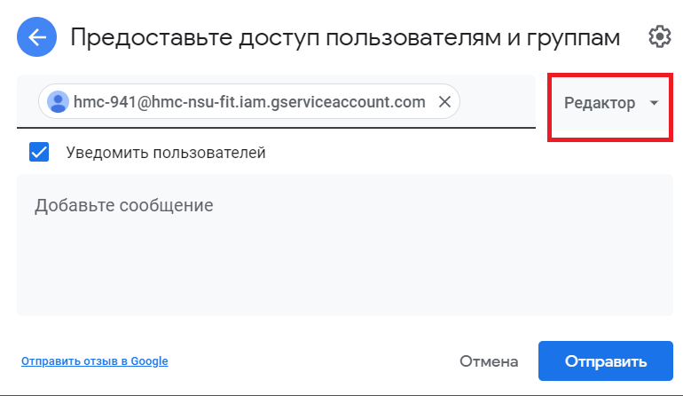

10. Перейдите по [ссылке](https://github.com/koshi8bit/lib-py) и скачайте библиотеку работы с google sheets. 
    Если Вы работете в PyCharm - ниже приведена пошаговая инструкция

    * Нажмите на Code и скопируйте https ссылку

    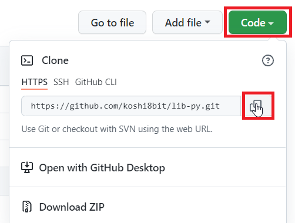

    * Откройте PyCharm и нажмите "Get from VCS".

    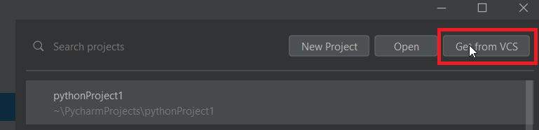

    * Вставьте скопированную ссылку и нажмите clone.
   
    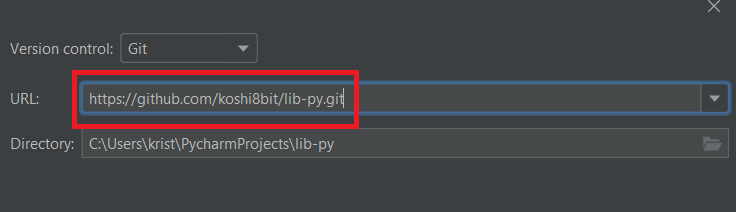

    * Вам придет запрос на создание виртуального окружения. Нажмите ok.

    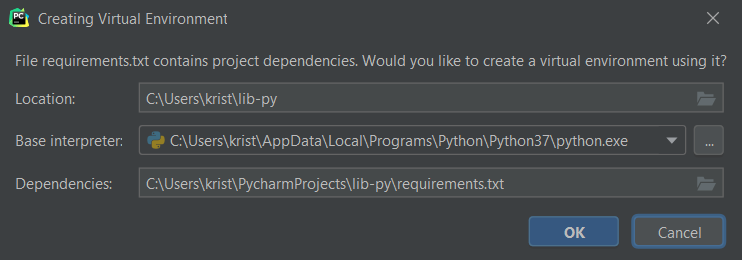

    * Переименуйте сгенеренный ранее и сохраненный на вашем компьютере ключ в creds.json и прикрепите его к проекту. 
   
    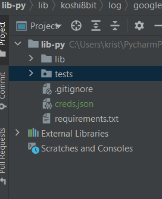

    * Создайте класс main
   
    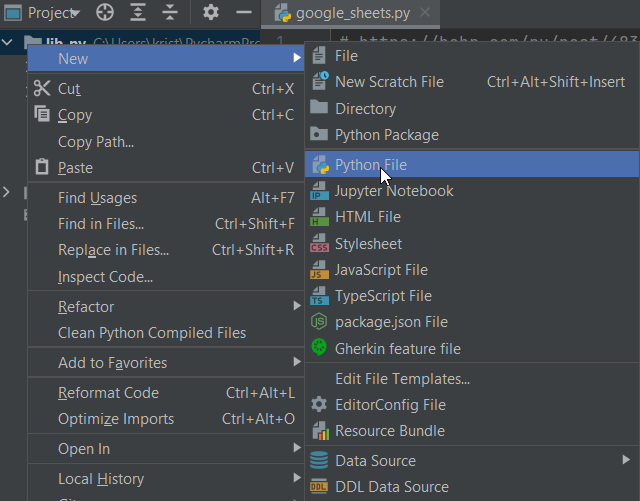   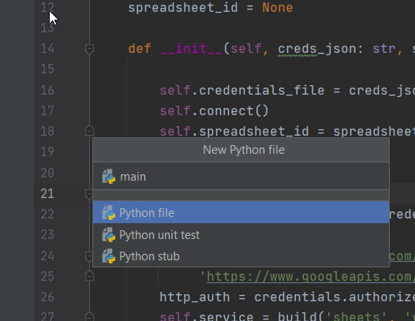

    * Добавьте туда данный код:
   ```from lib.koshi8bit.log.google_sheets.google_sheets import GoogleSheets

   if __name__ == '__main__':
        gs = GoogleSheets('creds.json', 'https://docs.google.com/spreadsheets/d/1aFk2e7fnHUCF1p61RTWp4t4auysu7dLkr_9M7WD3HdY/edit#gid=0')

        cell = gs.read_cell('Лист11', 'A1')
        print(cell)

        data = [[1, '2', 3], [4, 's5', 6]]
        res = gs.write('Лист11', 'B2:D', data)

        lines = gs.read('Лист11', 'A1:D4')
        print(lines)
   ```

11. Вернемся снова к гугл таблице. Сохраните весь url и вставьте в код вторым аргументом в класс GoogleSheets.

   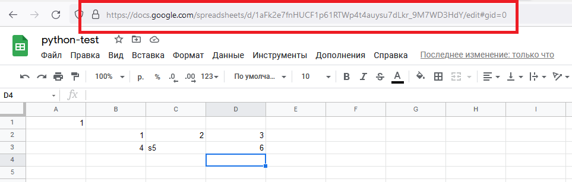

12. Переименуйте Лист1 в Лист11 или так как Вам хочется. Зафиксируйте это первым аргументом в read_cell.

   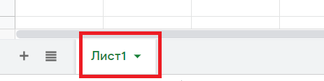

13. Запустите проект. У Вас должно получиться что-то такое:
 
   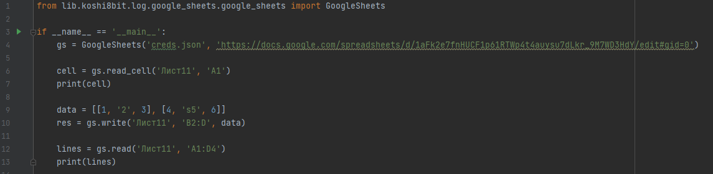   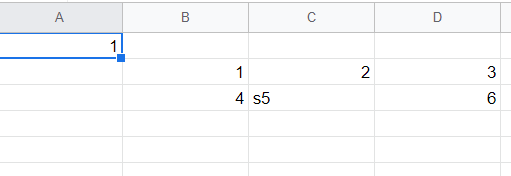

   


   
   
   

